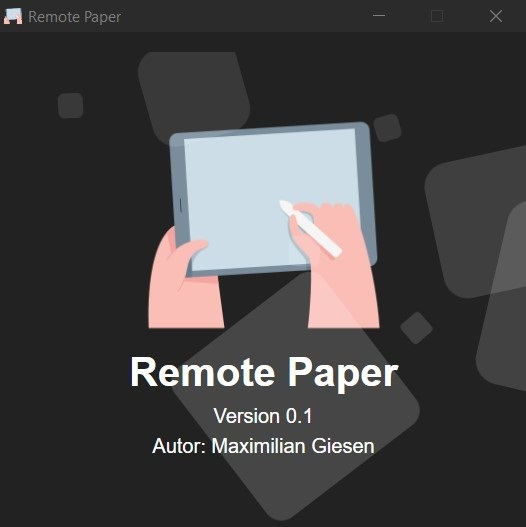

# Remote-Paper

In vielen Online-Meetings erstelle ich einfache Prinzipskizzen. Dabei habe ich stets meinen Apple Pencil vermisst, da er mir eine präzisere Eingabe ermöglicht als der Mauszeiger.

Remote-Paper ermöglicht die Spiegelung eines Skizzen-Blattes auf den Desktop bei paralleler Nutzung des Tablets. Hierzu startet die Anwendung auf dem Port 8080 ein simples Web-Interface auf das ein Tablet zugreifen kann, um mit einem digitalen Stift eine Skizze anzufertigen.

Sobald sich ein Client über die Computer-IP und den Port mit dem Server verbindet, öffnet sich automatisch ein neues Dokument, das mit dem Tablet gespiegelt wird. Die Kommunikation erfolgt über Websockets.

Das Projekt war ein Nachmittagsprojekt und steckt noch in der Kinderschuhen. Sinvolle nächste Schritte:

- Implemntierung Radiergummi
- Möglichkeit Skizzen in der Desktop-App zu speichern
- Möglichkeit Farben zu wechseln
- Handballenerkennung
- Performance optimieren und Code-Refactoring
